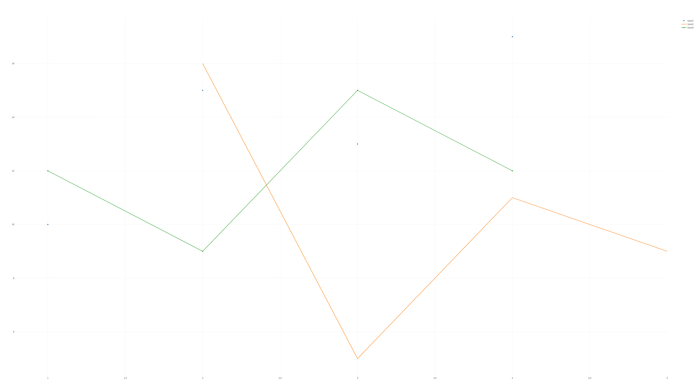
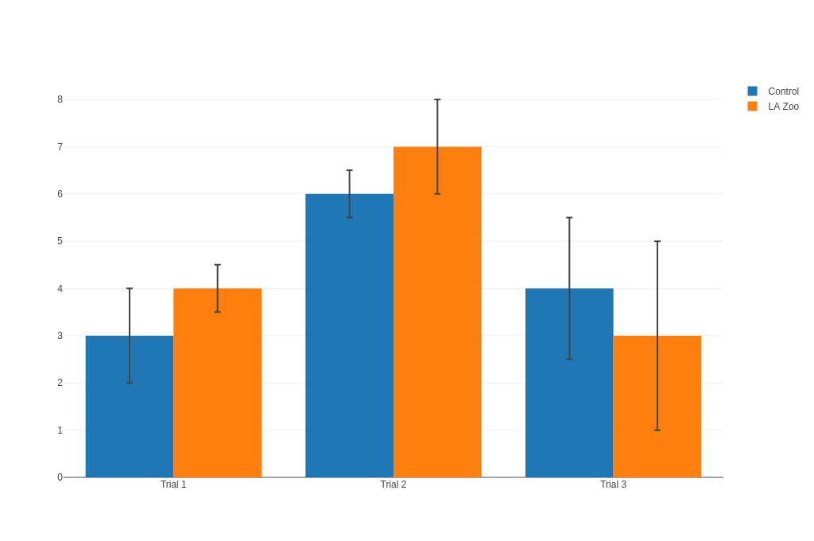
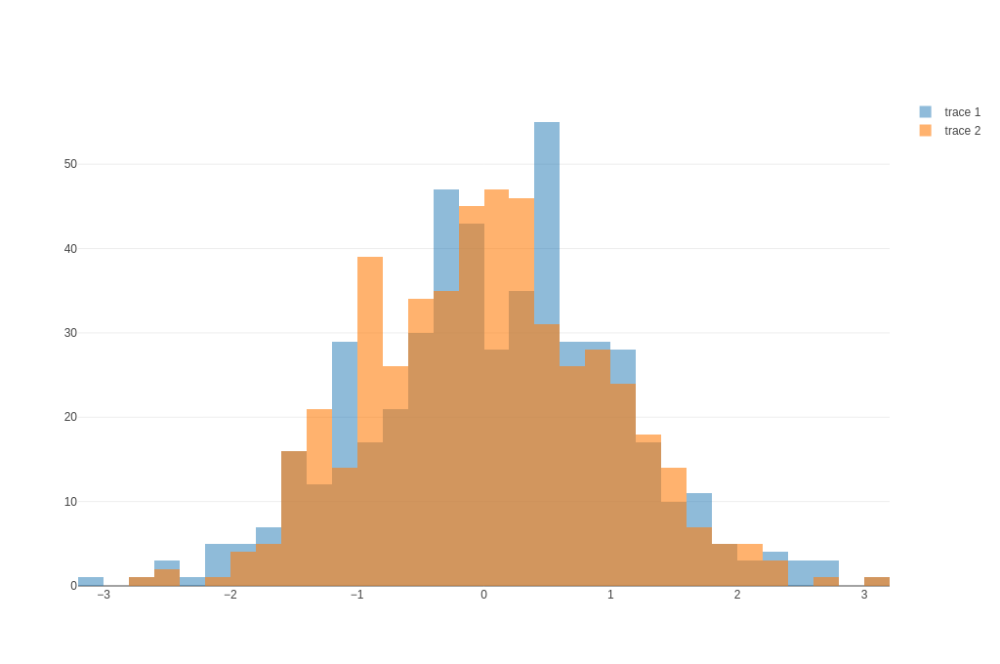
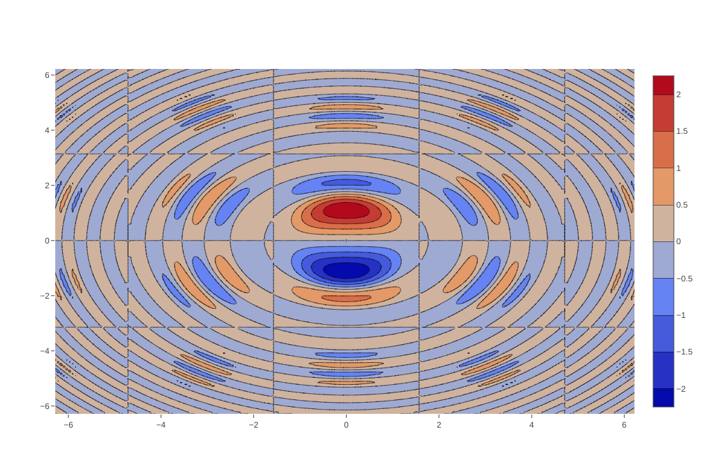
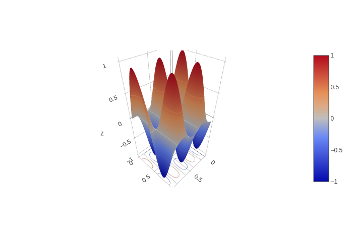

# Plotly for Rust [](https://crates.io/crates/plotly) [](https://docs.rs/plotly) 

A plotting library for Rust powered by [Plotly.js](https://plot.ly/javascript/).


## Usage

Add this to your `Cargo.toml`:

```toml
[dependencies]
plotly = "0.4.0"
```

For changes since the last version please consult the [change log](CHANGELOG.md).

## Crate Feature Flags
The following feature flags are available:
* `orca`
    * Optional, compatible with Rust stable.
    * Adds plot save functionality to the following formats: png, jpeg, webp, svg, pdf and eps.
    * Requires some additional configuration, see [plotly_orca](https://github.com/igiagkiozis/plotly/tree/master/plotly_orca).

Saving to png, jpeg, webp, svg, pdf and eps formats can be made available by enabling the `orca` feature: 

```toml
[dependencies]
plotly = { version = "0.4.0", features = ["orca"] }
```
This feature requires some manual configuration to function. For details and installation instructions
 please see the [plotly_orca](https://github.com/igiagkiozis/plotly/tree/dev/plotly_orca).

## Plotly in action
### Line and Scatter plot
```rust
extern crate plotly;
use plotly::common::Mode;
use plotly::{Plot, Scatter};

fn line_and_scatter_plot() {
    let trace1 = Scatter::new(vec![1, 2, 3, 4], vec![10, 15, 13, 17])
        .name("trace1")
        .mode(Mode::Markers);
    let trace2 = Scatter::new(vec![2, 3, 4, 5], vec![16, 5, 11, 9])
        .name("trace2")
        .mode(Mode::Lines);
    let trace3 = Scatter::new(vec![1, 2, 3, 4], vec![12, 9, 15, 12]).name("trace3");

    let mut plot = Plot::new();
    plot.add_trace(trace1);
    plot.add_trace(trace2);
    plot.add_trace(trace3);
    plot.show();
}

fn main() -> std::io::Result<()> {
    line_and_scatter_plot();
    Ok(())
}
```


```rust
extern crate plotly;
use plotly::{Plot, Scatter, Layout};
use plotly::common::{Mode, Line, LineShape, Font};
use plotly::layout::Legend;

fn line_shape_options_for_interpolation() {
    let trace1 = Scatter::new(vec![1, 2, 3, 4, 5], vec![1, 3, 2, 3, 1])
        .mode(Mode::LinesMarkers)
        .name("linear")
        .line(Line::new().shape(LineShape::Linear));
    let trace2 = Scatter::new(vec![1, 2, 3, 4, 5], vec![6, 8, 7, 8, 6])
        .mode(Mode::LinesMarkers)
        .name("spline")
        .line(Line::new().shape(LineShape::Spline));
    let trace3 = Scatter::new(vec![1, 2, 3, 4, 5], vec![11, 13, 12, 13, 11])
        .mode(Mode::LinesMarkers)
        .name("vhv")
        .line(Line::new().shape(LineShape::Vhv));
    let trace4 = Scatter::new(vec![1, 2, 3, 4, 5], vec![16, 18, 17, 18, 16])
        .mode(Mode::LinesMarkers)
        .name("hvh")
        .line(Line::new().shape(LineShape::Hvh));
    let trace5 = Scatter::new(vec![1, 2, 3, 4, 5], vec![21, 23, 22, 23, 21])
        .mode(Mode::LinesMarkers)
        .name("vh")
        .line(Line::new().shape(LineShape::Vh));
    let trace6 = Scatter::new(vec![1, 2, 3, 4, 5], vec![26, 28, 27, 28, 26])
        .mode(Mode::LinesMarkers)
        .name("hv")
        .line(Line::new().shape(LineShape::Hv));

    let mut plot = Plot::new();
    let layout = Layout::new()
        .legend(Legend::new().y(0.5).trace_order("reversed")
            .font(Font::new().size(16)));
    plot.set_layout(layout);
    plot.add_trace(trace1);
    plot.add_trace(trace2);
    plot.add_trace(trace3);
    plot.add_trace(trace4);
    plot.add_trace(trace5);
    plot.add_trace(trace6);
    plot.show();
}

fn main() -> std::io::Result<()> {
    line_shape_options_for_interpolation();
    Ok(())
}
```


```rust
extern crate plotly;
use plotly::{Plot, Scatter, Layout};
use plotly::common::{Mode, Line, DashType, Font};
use plotly::layout::{Legend, Axis};

fn line_dash() {
    let trace1 = Scatter::new(vec![1, 2, 3, 4, 5], vec![1, 3, 2, 3, 1])
        .mode(Mode::LinesMarkers)
        .name("solid")
        .line(Line::new().dash(DashType::Solid));
    let trace2 = Scatter::new(vec![1, 2, 3, 4, 5], vec![6, 8, 7, 8, 6])
        .mode(Mode::LinesMarkers)
        .name("dashdot")
        .line(Line::new().dash(DashType::DashDot));
    let trace3 = Scatter::new(vec![1, 2, 3, 4, 5], vec![11, 13, 12, 13, 11])
        .mode(Mode::LinesMarkers)
        .name("dash")
        .line(Line::new().dash(DashType::Dash));
    let trace4 = Scatter::new(vec![1, 2, 3, 4, 5], vec![16, 18, 17, 18, 16])
        .mode(Mode::LinesMarkers)
        .name("dot")
        .line(Line::new().dash(DashType::Dot));
    let trace5 = Scatter::new(vec![1, 2, 3, 4, 5], vec![21, 23, 22, 23, 21])
        .mode(Mode::LinesMarkers)
        .name("longdash")
        .line(Line::new().dash(DashType::LongDash));
    let trace6 = Scatter::new(vec![1, 2, 3, 4, 5], vec![26, 28, 27, 28, 26])
        .mode(Mode::LinesMarkers)
        .name("longdashdot")
        .line(Line::new().dash(DashType::LongDashDot));

    let mut plot = Plot::new();
    let layout = Layout::new()
        .legend(Legend::new().y(0.5).trace_order("reversed")
            .font(Font::new().size(16)))
        .xaxis(Axis::new().range(vec![0.95, 5.05]).auto_range(false))
        .yaxis(Axis::new().range(vec![0.0, 28.5]).auto_range(false));
    plot.set_layout(layout);
    plot.add_trace(trace1);
    plot.add_trace(trace2);
    plot.add_trace(trace3);
    plot.add_trace(trace4);
    plot.add_trace(trace5);
    plot.add_trace(trace6);
    plot.show();
}

fn main() -> std::io::Result<()> {
    line_dash();
    Ok(())
}
```


```rust
extern crate plotly;
use plotly::{Plot, Scatter, Rgb, NamedColor, Layout};
use plotly::common::{Mode, Marker, Line, Title};
use plotly::layout::Axis;

fn colored_and_styled_scatter_plot() {
    let trace1 = Scatter::new(vec![52698, 43117], vec![53, 31])
        .mode(Mode::Markers)
        .name("North America")
        .text_array(vec!["United States", "Canada"])
        .marker(
            Marker::new()
                .color(Rgb::new(164, 194, 244))
                .size(12)
                .line(Line::new().color(NamedColor::White).width(0.5)),
        );
    let trace2 = Scatter::new(
        vec![
            39317, 37236, 35650, 30066, 29570, 27159, 23557, 21046, 18007,
        ],
        vec![33, 20, 13, 19, 27, 19, 49, 44, 38],
    )
        .mode(Mode::Markers)
        .name("Europe")
        .text_array(vec![
            "Germany",
            "Britain",
            "France",
            "Spain",
            "Italy",
            "Czech Rep.",
            "Greece",
            "Poland",
        ])
        .marker(Marker::new().color(Rgb::new(255, 217, 102)).size(12));
    let trace3 = Scatter::new(
        vec![42952, 37037, 33106, 17478, 9813, 5253, 4692, 3899],
        vec![23, 42, 54, 89, 14, 99, 93, 70],
    )
        .mode(Mode::Markers)
        .name("Asia/Pacific")
        .text_array(vec![
            "Australia",
            "Japan",
            "South Korea",
            "Malaysia",
            "China",
            "Indonesia",
            "Philippines",
            "India",
        ])
        .marker(Marker::new().color(Rgb::new(234, 153, 153)).size(12));
    let trace4 = Scatter::new(
        vec![19097, 18601, 15595, 13546, 12026, 7434, 5419],
        vec![43, 47, 56, 80, 86, 93, 80],
    )
        .mode(Mode::Markers)
        .name("Latin America")
        .text_array(vec![
            "Chile",
            "Argentina",
            "Mexico",
            "Venezuela",
            "Venezuela",
            "El Salvador",
            "Bolivia",
        ])
        .marker(Marker::new().color(Rgb::new(142, 124, 195)).size(12));

    let layout = Layout::new()
        .title(Title::new("Quarter 1 Growth"))
        .xaxis(
            Axis::new()
                .title(Title::new("GDP per Capita"))
                .show_grid(false)
                .zero_line(false),
        )
        .yaxis(Axis::new().title(Title::new("Percent")).show_line(false));
    let mut plot = Plot::new();
    plot.add_trace(trace1);
    plot.add_trace(trace2);
    plot.add_trace(trace3);
    plot.add_trace(trace4);
    plot.set_layout(layout);
    plot.show_png(1024, 680);
    plot.show();
}

fn main() -> std::io::Result<()> {
    colored_and_styled_scatter_plot();
    Ok(())
}
```


For more examples see [scatter_and_line_plot_examples.rs](plotly/examples/scatter_and_line_plot_examples.rs).

### Bar plot
```rust
extern crate plotly;
use plotly::{Plot, Bar, Layout};
use plotly::common::{ErrorData, ErrorType};

fn bar_chart_with_error_bars() {
    let trace1 = Bar::new(
        vec!["Trial 1", "Trial 2", "Trial 3"],
        vec![3, 6, 4],
    )
        .name("Control")
        .error_y(ErrorData::new(ErrorType::Data).array(vec![1.0, 0.5, 1.5]));

    let trace2 = Bar::new(
        vec!["Trial 1", "Trial 2", "Trial 3"],
        vec![4, 7, 3],
    )
        .name("LA Zoo")
        .error_y(ErrorData::new(ErrorType::Data).array(vec![0.5, 1.0, 2.0]));

    let layout = Layout::new();
    let mut plot = Plot::new();
    plot.add_trace(trace1);
    plot.add_trace(trace2);
    plot.set_layout(layout);
    plot.show();
}

fn main() -> std::io::Result<()> {
    bar_chart_with_error_bars();
    Ok(())
}
```


For more examples see [bar_plot_examples.rs](plotly/examples/bar_plot_examples.rs).

### Histogram plot
```rust
extern crate plotly;
use plotly::{Plot, Histogram, NamedColor, Layout};
use plotly::common::Marker;
use plotly::layout::BarMode;
use rand_distr::{Distribution, Normal};

fn sample_normal_distribution(n: usize, mean: f64, std_dev: f64) -> Vec<f64> {
    let mut rng = rand::thread_rng();
    let dist = Normal::new(mean, std_dev).unwrap();
    let mut v = Vec::<f64>::with_capacity(n);
    for _idx in 1..n {
        v.push(dist.sample(&mut rng));
    }
    v
}

fn overlaid_histogram() {
    let samples1 = sample_normal_distribution(500, 0.0, 1.0);
    let trace1 = Histogram::new(samples1)
        .name("trace 1")
        .opacity(0.5)
        .marker(Marker::new().color(NamedColor::Green));

    let samples2 = sample_normal_distribution(500, 0.0, 1.0);
    let trace2 = Histogram::new(samples2)
        .name("trace 2")
        .opacity(0.6)
        .marker(Marker::new().color(NamedColor::Red));

    let mut plot = Plot::new();
    plot.add_trace(trace1);
    plot.add_trace(trace2);

    let layout = Layout::new().bar_mode(BarMode::Overlay);
    plot.set_layout(layout);
    plot.show();
}

fn main() -> std::io::Result<()> {
    overlaid_histogram();
    Ok(())
}
```


For more examples see [histogram_plot_examples.rs](plotly/examples/histogram_plot_examples.rs).


### Candlestick plot
```rust
extern crate plotly;
use plotly::{Plot, Candlestick};

fn simple_candlestick_chart() {
    let x = vec![
        "2017-01-04","2017-01-05","2017-01-06","2017-01-09","2017-01-10","2017-01-11","2017-01-12",
        "2017-01-13","2017-01-17","2017-01-18","2017-01-19","2017-01-20","2017-01-23","2017-01-24",
        "2017-01-25","2017-01-26","2017-01-27","2017-01-30","2017-01-31","2017-02-01","2017-02-02",
        "2017-02-03","2017-02-06","2017-02-07","2017-02-08","2017-02-09","2017-02-10","2017-02-13",
        "2017-02-14","2017-02-15",];
    let open = vec![
        115.849998, 115.919998, 116.779999, 117.949997, 118.769997, 118.739998, 118.900002,
        119.110001, 118.339996, 120.0, 119.400002, 120.449997, 120.0, 119.550003, 120.419998,
        121.669998, 122.139999, 120.93, 121.150002, 127.029999, 127.980003, 128.309998, 129.130005,
        130.539993, 131.350006, 131.649994, 132.460007, 133.080002, 133.470001, 135.520004,
    ];
    let high = vec![
        116.510002, 116.860001, 118.160004, 119.43, 119.379997, 119.93, 119.300003, 119.620003,
        120.239998, 120.5, 120.089996, 120.449997, 120.809998, 120.099998, 122.099998, 122.440002,
        122.349998, 121.629997, 121.389999, 130.490005, 129.389999, 129.190002, 130.5, 132.089996,
        132.220001, 132.449997, 132.940002, 133.820007, 135.089996, 136.270004,
    ];
    let low = vec![
        115.75, 115.809998, 116.470001, 117.940002, 118.300003, 118.599998, 118.209999, 118.809998,
        118.220001, 119.709999, 119.370003, 119.730003, 119.769997, 119.5, 120.279999, 121.599998,
        121.599998, 120.660004, 120.620003, 127.010002, 127.779999, 128.160004, 128.899994,
        130.449997, 131.220001, 131.119995, 132.050003, 132.75, 133.25, 134.619995,
    ];
    let close = vec![
        116.019997, 116.610001, 117.910004, 118.989998, 119.110001, 119.75, 119.25, 119.040001,
        120.0, 119.989998, 119.779999, 120.0, 120.080002, 119.970001, 121.879997, 121.940002,
        121.949997, 121.629997, 121.349998, 128.75, 128.529999, 129.080002, 130.289993, 131.529999,
        132.039993, 132.419998, 132.119995, 133.289993, 135.020004, 135.509995,
    ];

    let trace1 = Candlestick::new(x, open, high, low, close);

    let mut plot = Plot::new();
    plot.add_trace(trace1);
    plot.show();
}

fn main() -> std::io::Result<()> {
    simple_candlestick_chart();
    Ok(())
}
```


For more examples see [candlestick_plot_examples.rs](plotly/examples/candlestick_plot_examples.rs).

### OHLC plot
```rust
extern crate plotly;
use plotly::{Plot, Ohlc};

fn simple_ohlc_chart() {
    let x = vec![
        "2017-01-04","2017-01-05","2017-01-06","2017-01-09","2017-01-10","2017-01-11","2017-01-12",
        "2017-01-13","2017-01-17","2017-01-18","2017-01-19","2017-01-20","2017-01-23","2017-01-24",
        "2017-01-25","2017-01-26","2017-01-27","2017-01-30","2017-01-31","2017-02-01","2017-02-02",
        "2017-02-03","2017-02-06","2017-02-07","2017-02-08","2017-02-09","2017-02-10","2017-02-13",
        "2017-02-14","2017-02-15",];
    let open = vec![
        115.849998, 115.919998, 116.779999, 117.949997, 118.769997, 118.739998, 118.900002,
        119.110001, 118.339996, 120.0, 119.400002, 120.449997, 120.0, 119.550003, 120.419998,
        121.669998, 122.139999, 120.93, 121.150002, 127.029999, 127.980003, 128.309998, 129.130005,
        130.539993, 131.350006, 131.649994, 132.460007, 133.080002, 133.470001, 135.520004,
    ];
    let high = vec![
        116.510002, 116.860001, 118.160004, 119.43, 119.379997, 119.93, 119.300003, 119.620003,
        120.239998, 120.5, 120.089996, 120.449997, 120.809998, 120.099998, 122.099998, 122.440002,
        122.349998, 121.629997, 121.389999, 130.490005, 129.389999, 129.190002, 130.5, 132.089996,
        132.220001, 132.449997, 132.940002, 133.820007, 135.089996, 136.270004,
    ];
    let low = vec![
        115.75, 115.809998, 116.470001, 117.940002, 118.300003, 118.599998, 118.209999, 118.809998,
        118.220001, 119.709999, 119.370003, 119.730003, 119.769997, 119.5, 120.279999, 121.599998,
        121.599998, 120.660004, 120.620003, 127.010002, 127.779999, 128.160004, 128.899994,
        130.449997, 131.220001, 131.119995, 132.050003, 132.75, 133.25, 134.619995,
    ];
    let close = vec![
        116.019997, 116.610001, 117.910004, 118.989998, 119.110001, 119.75, 119.25, 119.040001,
        120.0, 119.989998, 119.779999, 120.0, 120.080002, 119.970001, 121.879997, 121.940002,
        121.949997, 121.629997, 121.349998, 128.75, 128.529999, 129.080002, 130.289993, 131.529999,
        132.039993, 132.419998, 132.119995, 133.289993, 135.020004, 135.509995,
    ];

    let trace1 = Ohlc::new(x, open, high, low, close);

    let mut plot = Plot::new();
    plot.add_trace(trace1);
    plot.show();
}

fn main() -> std::io::Result<()> {
    simple_ohlc_chart();
    Ok(())
}
```


For more examples see [ohlc_plot_examples.rs](plotly/examples/ohlc_plot_examples.rs).

### Contour plot
```rust
extern crate plotly;
use plotly::{Plot, Contour, Layout};
use std::f64::consts::PI;
use plotly::common::{Title, ColorScale, ColorScalePalette, Mode};
use plotly::contour::Contours;

fn simple_contour_plot() {
    let n = 200;
    let mut x = Vec::<f64>::new();
    let mut y = Vec::<f64>::new();
    let mut z: Vec<Vec<f64>> = Vec::new();

    for index in 0..n {
        let value = -2.0 * PI + 4.0 * PI * (index as f64) / (n as f64);
        x.push(value);
        y.push(value);
    }

    for xi in 0..n {
        let mut row = Vec::<f64>::new();
        for yi in 0..n {
            let radius_squared = x[xi].powf(2.0) + y[yi].powf(2.0);
            let zv = x[xi].sin() * y[yi].cos() * radius_squared.sin() / (radius_squared + 1.0).log10();
            row.push(zv);
        }
        z.push(row);
    }

    let trace = Contour::new(x, y,z);
    let mut plot = Plot::new();

    plot.add_trace(trace);
    plot.show();
}


fn main() -> std::io::Result<()> {
    simple_contour_plot();
    Ok(())
}
```


For more examples see [contour_examples.rs](plotly/examples/contour_examples.rs). 


### Heat-map Plot
```rust
extern crate plotly;
use plotly::{Plot, HeatMap};

fn basic_heat_map() {
    let z = vec![vec![1, 20, 30], vec![20, 1, 60], vec![30, 60, 1]];
    let trace = HeatMap::new_z(z);
    let mut plot = Plot::new();
    plot.add_trace(trace);
    plot.show();
}

fn main() -> std::io::Result<()> {
    basic_heat_map();
    Ok(())
}
```


For more examples see [heat_map_examples.rs](plotly/examples/heat_map_examples.rs). 

### Surface plot
```rust
extern crate plotly;
use plotly::{Plot, Surface, Layout};
use plotly::surface::{Lighting, PlaneContours, PlaneProject, SurfaceContours};

fn spectral_surface_plot() {
    let mut x: Vec<f64> = Vec::new();
    let mut y: Vec<f64> = Vec::new();
    let mut z: Vec<Vec<f64>> = Vec::new();
    let N = 100;

    for i in 0..N {
        x.push(i as f64 / N as f64);
        y.push(i as f64 / N as f64);
    }

    for xi in 0..N {
        let mut iz: Vec<f64> = Vec::new();
        for yi in 0..N {
            let xf = (xi as f64) / N as f64;
            let yf = (yi as f64) / N as f64;

            let cz = (2.0 * xf * std::f64::consts::PI).sin() * (4.0 * yf * std::f64::consts::PI).cos();
            iz.push(cz);
        }
        z.push(iz);
    }

    let trace = Surface::new(z).x(x).y(y).visible(true)
        .hide_surface(false).lighting(Lighting::new())
        .contours(SurfaceContours::new().z(PlaneContours::new()
            .show(true).use_colormap(true).project(PlaneProject::new().z(true))));
    let mut plot = Plot::new();
    plot.set_layout(Layout::new());
    plot.add_trace(trace);
    plot.show();
}

fn main() -> std::io::Result<()> {
    spectral_surface_plot();
    Ok(())
}
```


For more examples see [surface_plot_examples.rs](plotly/examples/surface_plot_examples.rs). 

### Save plots
At present it is only possible to save plots in *PNG*, *JPEG* and *HTML* format with the help of the browser. For example the 
following code: 

```rust
extern crate plotly;
use plotly::common::Mode;
use plotly::{Plot, Scatter};

fn line_and_scatter_plot() {
    let trace1 = Scatter::new(vec![1, 2, 3, 4], vec![10, 15, 13, 17])
        .name("trace1")
        .mode(Mode::Markers);
    let trace2 = Scatter::new(vec![2, 3, 4, 5], vec![16, 5, 11, 9])
        .name("trace2")
        .mode(Mode::Lines);
    let trace3 = Scatter::new(vec![1, 2, 3, 4], vec![12, 9, 15, 12]).name("trace3");

    let mut plot = Plot::new();
    plot.add_trace(trace1);
    plot.add_trace(trace2);
    plot.add_trace(trace3);
    // The following will generate the plot in PNG format (width: 1024, height: 680) and display it in the browser.
    plot.show_png(1024, 680);
    // Similarly to the above line but with a JPEG format output.
    plot.show_jpeg(1024, 680);
    // Save the resulting plot in `filename.html`
    plot.to_html("filename.html");
    plot.show();
}

fn main() -> std::io::Result<()> {
    line_and_scatter_plot();
    Ok(())
}
``` 
will open 3 tabs in the browser with the first two containing the *PNG* and *JPEG* outputs respectively. Then these must be saved manually 
by right clicking and selecting `Save As...` in the context menu of the browser. This is somewhat cumbersome. 
An alternative is to use the `orca` feature which draws on the [Orca](https://github.com/plotly/orca) package to directly convert
plot data to several formats. The `orca` feature enables `to_*` methods where`*` is one of the supported formats: png, jpeg, webp, svg, pdf and eps.
The **caveat** is that there is a manual installation step required for this to work. For instructions please see:
[plotly_orca](https://github.com/igiagkiozis/plotly/tree/master/plotly_orca). 

# License

Plotly for Rust is distributed under the terms of both the MIT license.

See [LICENSE-MIT](LICENSE-MIT), and [COPYRIGHT](COPYRIGHT) for details.
