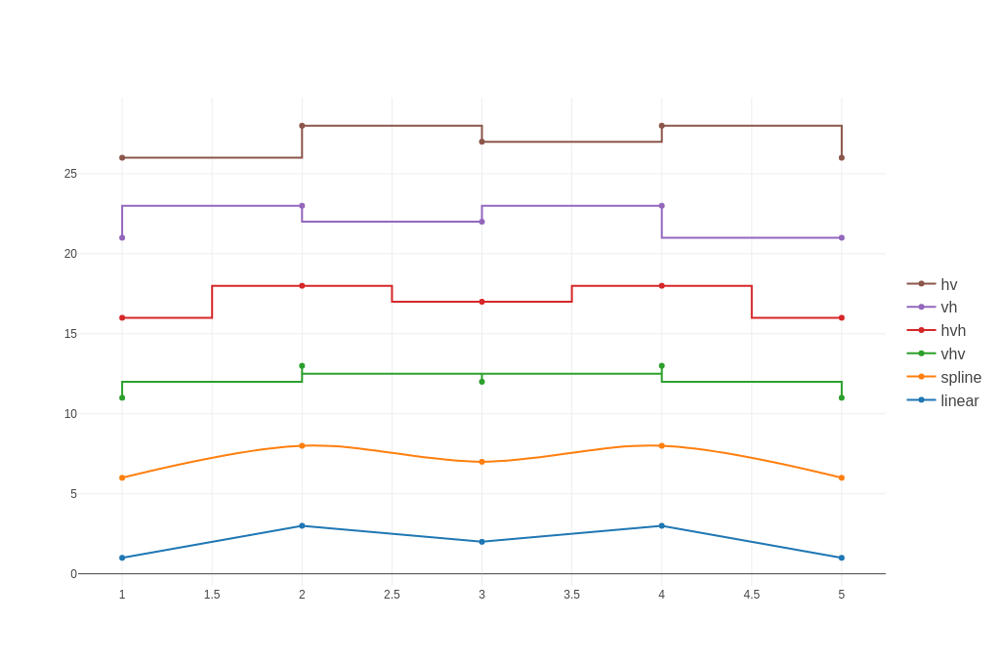
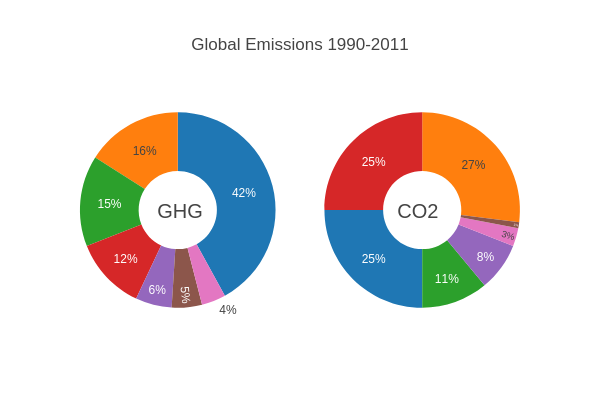

# Basic Charts

The source code for the following examples can also be found [here](https://github.com/plotly/plotly.rs/tree/main/examples/basic_charts).

Kind | Link
:---|:----:
Scatter Plots |
Line Charts | 
Bar Charts | 
Pie Charts | 
Sankey Diagrams | 
