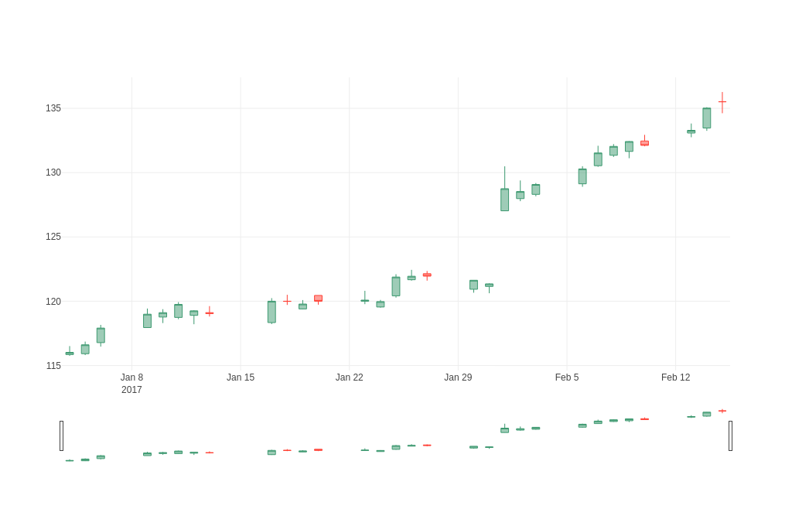

# Financial Charts

The source code for the following examples can also be found [here](https://github.com/plotly/plotly.rs/tree/main/examples/financial_charts).

Kind | Link
:---|:----:
Time Series and Date Axes |
Candlestick Charts | 
OHLC Charts | 
